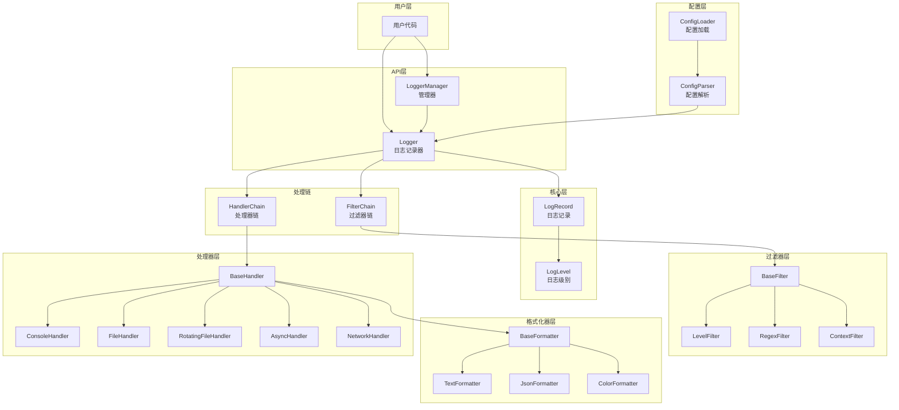
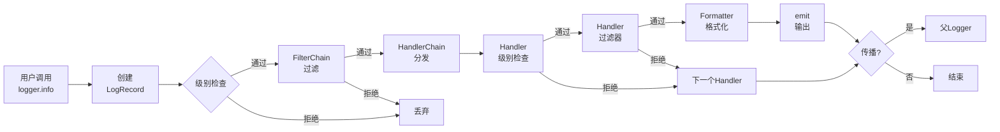

# Logify 架构设计文档

## 1. 概述

Logify 是一个功能完善、易于扩展的 Python 日志处理模块。采用分层架构设计，支持多种日志输出方式、灵活的格式化选项和强大的过滤机制。

## 2. 整体架构图



## 3. 日志处理流程



## 4. 模块职责说明

### 4.1 API 层 (`api/`)

| 组件 | 职责 |
|------|------|
| **Logger** | 日志记录的主入口，提供 `debug()`, `info()`, `warning()`, `error()`, `critical()` 等方法；支持上下文管理、函数追踪装饰器；管理处理器链和过滤器链 |

### 4.2 核心层 (`core/`)

| 组件 | 职责 |
|------|------|
| **LogLevel** | 定义日志级别枚举（DEBUG=10, INFO=20, WARNING=30, ERROR=40, CRITICAL=50）；提供级别名称与数值的双向转换 |
| **LogRecord** | 日志记录的数据载体，封装时间戳、级别、消息、调用位置、线程/进程信息、异常信息等 |
| **LoggerManager** | 单例模式的 Logger 管理器；负责 Logger 的创建、缓存和层级关系管理；通过名称中的点号（如 `app.module`）建立父子关系 |

### 4.3 处理器层 (`handlers/`)

| 组件 | 职责 |
|------|------|
| **BaseHandler** | 处理器抽象基类，定义 `emit()` 接口；提供级别检查、过滤、格式化等通用功能 |
| **HandlerChain** | 处理器责任链，将日志分发到多个处理器 |
| **ConsoleHandler** | 输出日志到控制台（stdout/stderr） |
| **FileHandler** | 输出日志到文件 |
| **RotatingFileHandler** | 按文件大小轮转日志文件 |
| **TimedRotatingFileHandler** | 按时间周期轮转日志文件 |
| **AsyncHandler** | 异步处理日志，避免阻塞主线程 |
| **NetworkHandler** | 网络日志输出基类（TCP/UDP/HTTP） |

### 4.4 格式化器层 (`formatters/`)

| 组件 | 职责 |
|------|------|
| **BaseFormatter** | 格式化器抽象基类，定义 `format()` 接口；提供异常格式化通用方法 |
| **TextFormatter** | 文本格式化，支持自定义格式模板（类似 Python logging 的格式字符串） |
| **JsonFormatter** | JSON 格式化，输出结构化日志 |
| **ColorFormatter** | 彩色格式化，根据日志级别添加终端颜色 |

### 4.5 过滤器层 (`filters/`)

| 组件 | 职责 |
|------|------|
| **BaseFilter** | 过滤器抽象基类，定义 `filter()` 接口 |
| **FilterChain** | 过滤器责任链，按顺序执行多个过滤器 |
| **LevelFilter** | 按日志级别过滤 |
| **RegexFilter** | 按正则表达式匹配消息内容过滤 |
| **ContextFilter** | 按上下文数据过滤 |

### 4.6 配置层 (`config/`)

| 组件 | 职责 |
|------|------|
| **ConfigLoader** | 配置加载器；支持从 JSON、YAML、TOML 文件或环境变量加载配置 |
| **ConfigParser** | 配置解析器；解析配置字典并创建对应的 Logger、Handler、Formatter、Filter 组件 |

## 5. 设计模式应用

| 设计模式 | 应用场景 |
|----------|----------|
| **单例模式** | `LoggerManager` 全局唯一实例，统一管理所有 Logger |
| **责任链模式** | `FilterChain` 和 `HandlerChain` 实现日志的链式处理 |
| **模板方法模式** | `BaseHandler.handle()` 定义处理流程骨架，子类实现 `emit()` |
| **策略模式** | 格式化器和过滤器可灵活替换，实现不同的格式化和过滤策略 |
| **工厂模式** | `ConfigParser` 根据配置创建不同类型的组件实例 |

## 6. 扩展机制

Logify 提供了良好的扩展性：

1. **自定义处理器**：继承 `BaseHandler` 并实现 `emit()` 方法
2. **自定义格式化器**：继承 `BaseFormatter` 并实现 `format()` 方法
3. **自定义过滤器**：继承 `BaseFilter` 并实现 `filter()` 方法
4. **组件注册**：通过 `ConfigParser.register_*()` 方法注册自定义组件类

## 7. 目录结构

```
logify/
├── __init__.py          # 包入口，导出所有公共 API
├── api/
│   └── logger.py        # Logger 日志记录器
├── core/
│   ├── levels.py        # 日志级别定义
│   ├── manager.py       # Logger 管理器
│   └── record.py        # 日志记录数据结构
├── handlers/
│   ├── base.py          # 处理器基类
│   ├── console.py       # 控制台处理器
│   ├── file.py          # 文件处理器
│   ├── rotating.py      # 日志轮转处理器
│   ├── async_handler.py # 异步处理器
│   └── network.py       # 网络处理器
├── formatters/
│   ├── base.py          # 格式化器基类
│   ├── text.py          # 文本格式化器
│   ├── json_formatter.py# JSON 格式化器
│   └── color.py         # 彩色格式化器
├── filters/
│   ├── base.py          # 过滤器基类
│   ├── level_filter.py  # 级别过滤器
│   ├── regex_filter.py  # 正则过滤器
│   └── context_filter.py# 上下文过滤器
└── config/
    ├── loader.py        # 配置加载器
    └── parser.py        # 配置解析器
```
